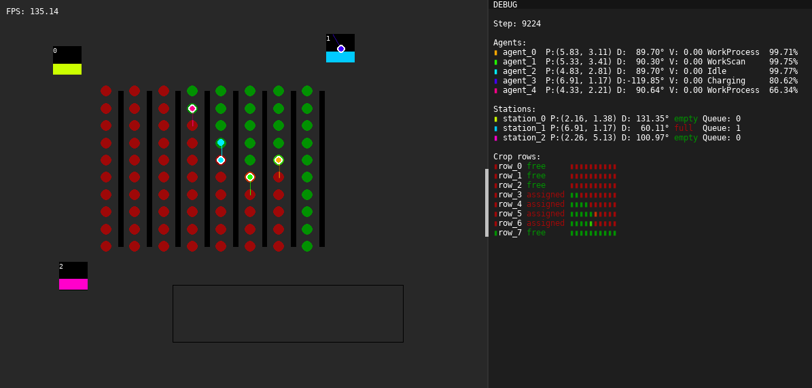

# farmbotsim

**farmbotsim** was made to assist with real-world agricultural automation by providing a reliable simulation. In this simulation we can focus on charging strategies and productivity matrix.



## Table of Contents
- [Prerequisites](#prerequisites)
- [Installation](#installation)
- [Usage](#usage)
- [Code Structure Overview](#code-structure-overview)

## Prerequisites

Before getting started, you need to have **[Python](https://www.python.org/downloads/)** installed on your machine.

Additionally, it's recommended to have **[Git](https://git-scm.com/)** installed to clone the repository.

## Installation

Follow these steps to get farmbotsim running locally:

1. Clone the repository:
   ```bash
   git clone https://github.com/Axstr0n/farmbotsim.git
   ```

2. Navigate to the project directory:
    ```bash
    cd farmbotsim
    ```

3. Set up a virtual environment:
    - Windows:
        ```bash
        python -m venv venv
        venv\Scripts\activate
        ```
    - macOS/Linux:
        ```bash
        python3 -m venv venv
        source venv/bin/activate
        ```

4. Install dependencies:
    ```bash
    pip install -r requirements.txt
    ```

## Usage
After installation you can run main file like:
```
batch_files/main.bat
```
and other preview files similarly.

## Code Structure Overview

The **farmbotsim** project is organized into several directories that help separate functionality. Here's a high-level breakdown:

`assets/` - Stores external files such as fonts.

`batch_files/` - Contains scripts for running all preview simulations.

`batteries/` - Contains battery specific configuration and charge characteristics.

`screenshots/` - Contains screenshots of project.

`src/` - Contains the core logic of the simulation:
- `agent/` - Contains the agent class and its associated logic, such as state machine, movement, battery.
- `path_planning/` - Includes code related to robot navigation and pathfinding algorithms.
- `preview/` - Contains scripts for visualizing the simulation, including the scene editor.
- `rendering/` - Responsible for rendering the simulation environment and visual feedback.
- `scene/` - Defines the scene, crops, charging stations.
- `task_management/` - Manages task assignments.
- `utilities/` - Common utilities and helper functions used across the project including configuration.
- `config.json` - Configuration file for scene/layout.
- `env.py` - Contains main class for simulation.
- `main.py` - Runs the simulation.

`.gitignore` - Ignores virtual environment, compiled python files.

`README.md` - This file, which contains documentation and instructions for setting up and using the simulation.

`requirements.txt` - Lists the required dependencies for the project.
